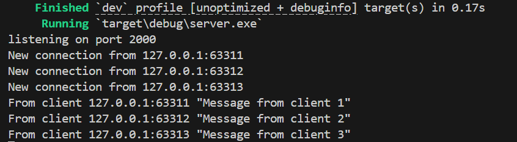
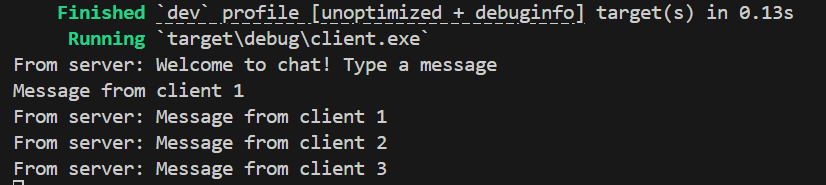
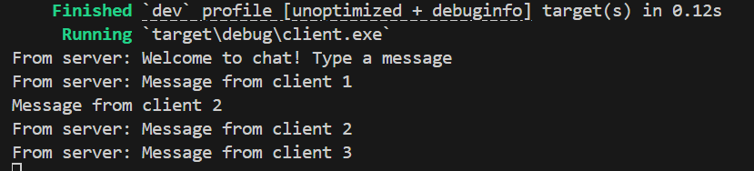
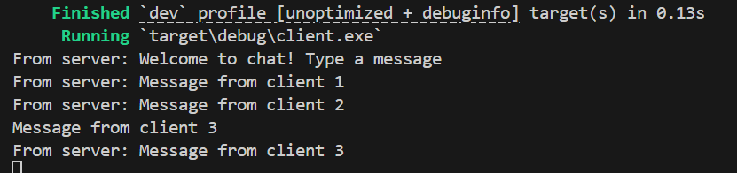
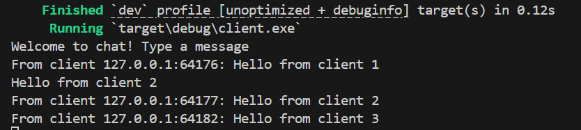

# Module-10-AsynchronousProgramming-Chat
adpro stuff

## Commit 1
### Server 

### Client 1

### Client 2

### Client 3

>
> To run the server, go to the main directory (chat) and do cargo run --bin server
>
> To run the clients, go to the main directory (chat) and do cargo run --bin client
>
> When you type in some words in the client, it will be sent to the server and then the server will broadcast the message to all clients, including the client who sent the message.

## Commit 2
> Websocket is used for both the client and the server. In the client, it is defined when ClientBuilder::from_uri(Uri::from_static("ws://127.0.0.1:8080")). The ws part. While in the Server, it first makes a TCP server with let listener = TcpListener::bind("127.0.0.1:8080").await?; then uses websockets on top of it in let (_req, ws_stream) = ServerBuilder::new().accept(socket).await?;

## Commit 3

> In the server, I passed the address that the message came from as part of the message so that it shows up in the chats. Removed some of the previously made prefixes in the client. 